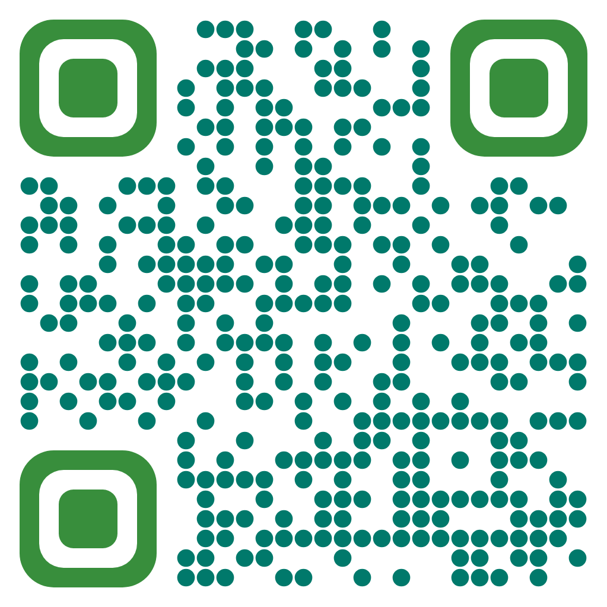

## Siemens LOGO! Workshop - Node Red

This workshop demonstrates the connection of Siemens LOGO! PLC and Node - Red web based framework. As a demonstration task, this simple demonstration refers to the control of an industrial greenhouse. Based on the available hardware basic control demonstration is presented with the power of Node-Red.


## Technology

```bash

+--------------------+                        +----------------+
| LOGO! PLC          |     <-- Snap7 -->      |  Node-Red      |
+--------------------+                        +----------------+


```

The Software platform for virtualization the solution is **Docker Compose**.


```javascript
Software
------------------------------------
| Node-Red
|   - node-red-contrib-s7
|   - node-red-dashboard
```

## Case

An integral part of this small project is the creation of two flows, an **offline-greenhouse to simulate process** and an **online-greenhouse to connect to real hardware**.

Individual sensors and control parts (temp. sensors, motors, etc.) are connected to the LOGO! This control unit then communicates with Node-Red using Snap7 communication where the control logic is designed in Node-Red software and via dashboard package is generated very simple web-based visualization.


## Hardware


## Software


:red_circle: Brno University of Technology,

:large_blue_circle: Faculty of Mechanical Engineering,

:computer: Institute of Automation and Computer Science

